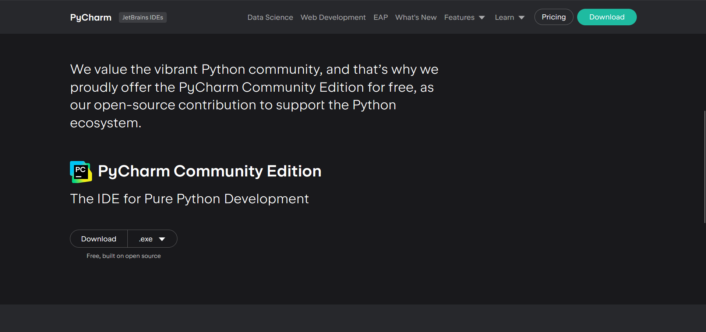

### Why use Python?
* Open-source (it's **FREE** to use personally or commercially)
* You can use it on:
  1. Windows
  2. Mac
  3. Linux
* Helpful community: it is quite likely someone has already encountered your problem before.
* **LOTS** of possible applications, such as web development, machine learning, and statistical analysis.

## How to Download Python:

* Head to the [Python downloads page](python.org/downloads/).
* It is **recommended** to use PyCharm (head [here](https://www.jetbrains.com/pycharm/download/?section=windows)  and scroll to download the free Community Edition)  to edit your code. It's a really helpful tool which can even suggest ways to improve your work.
* Open a **NEW** Project in PyCharm.
* Choose Pure Python on the languages tab.
* Press *Create*.
* You're ready to start coding in Python.

You should test that your computer can interpret the language first. It's a formality to use: <br>
```commandline
print("Hello World")
```
Try using the '#' character on the same line (outside the print statement) to **comment** your name, like this: <br>

`print("Hello World") # My name is Sam!`

The output `Hello World` is a string.

## Data Types ##

There are three fundamental data types used within any usual Python file.
1. **Numbers**
   1. `int`: For integers like `23`, `350000` or `0`.
   2. `float`: For decimals like `5.555`.
2. **Strings** like `Hello World`.
3. **Boolean** for True or False, or 1 or 0.

Use `print(type("your data type here"))` to check your data type.

## Maths Operators

You can use these with **Numbers**.
* `+`: Add
* `-`: Subtract
* `*`: Multiply
* `/`: Divide

Python is a calculator! <div style="width:100px"> </div> Try dividing by 0 to recognise your first error.
