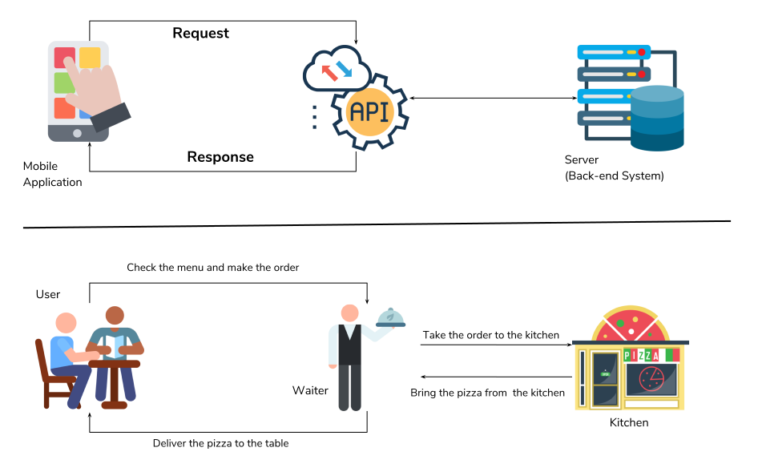

# JSON
 
## What does it stand for?

JSON is short for JavaScript Object Notation.
## What is it used for?

It is used for data interchange between different systems due to its simple key-value notation. Most commonly, it is used to transmit data between a server and a web application. It's used across many programming languages to read and write to files, and many languages have the capability to support working with JSON data.
## What is it written in?
It's written in plain text notation and is based on a subset of JavaScript syntax, where the contents are key-value pairs separated by colons, with each pair separated by commas.
## What data types can it store/use?
You can store strings, numbers and booleans in a .json file, along with arrays and objects where key-value pairs are usually stored enclosed by curly brackets. This is considered to be flexible and contributes to its wide usage across many systems and languages.
## What is the JSON syntax for:
 
- Name value pairs?
  * Keys and values are separated by colons, while the pairs of key-values are separated by commas. 
- Objects?
  * Objects are initiated by curly brackets. These are commonly held on separate lines to make the contents easier to read.
- How to separate data objects from one another?
  * Different objects must be separated by commas. There could most likely be a single root object that holds other objects as values with keys defining their purpose.
- JSON arrays (these are like lists in python)?
  * These are stored within square brackets, and they can hold objects and arrays within them.

# APIs

## What are APIs?
An API (or Application Programming Interface) is a set of protocols and tools that allows software components to communicate with each other. 
## How are APIs used and why are they popular?
They are used in order to interact with a server and gather information, and they can be related to a menu at a restaurant. You can make requests for different pieces of information or functions that the API offers e.g. weather apps use APIs to fetch data from a weather, and also make custom requests to what you want back from the server.
## Find a diagram that showcases the API data transfer process.

## What are REST APIs? What makes an API Restful?
 
APIs can be designed with REST (Representational State Transfer), a popular blueprint. A RESTful API uses HTTP methods. These methods are used to perform operations (often called CRUD for Create, Read, Update, Delete) on resources identified by URLs. These APIs use JSON as the data format for the exchange of information. They hold certain characteristics:
* Representational
* URIs
* Statelessness
* Caching

## What is HTTP?
HTTP ( Hypertext Transfer Protocol ) is a protocol which is used for communication between computers and requesting/responding with information, sort of like the postal service if you would like to send a letter to a friend. It uses URLs as the addresses where they would send requests for information to a server. When the servers send a response back over the internet, it would consist of your requested information.
Find diagrams that showcase:
 
- HTTP Request Structure
- HTTP Response Structure
 

 
## What are the 5 HTTP verbs?
* GET: Used to request data from a specified resource, without modifying the source itself.
* POST: Used to submit data to be processed to a specific resource, typically in order to create a new resource or submitting form data
* PUT: Used to replace the entire specified resource with the specified data
* DELETE: Used to delete a specified resource entirely from the server
* PATCH: Like PUT, but only places the data within the resource without replacing the entire block a.k.a. modify.